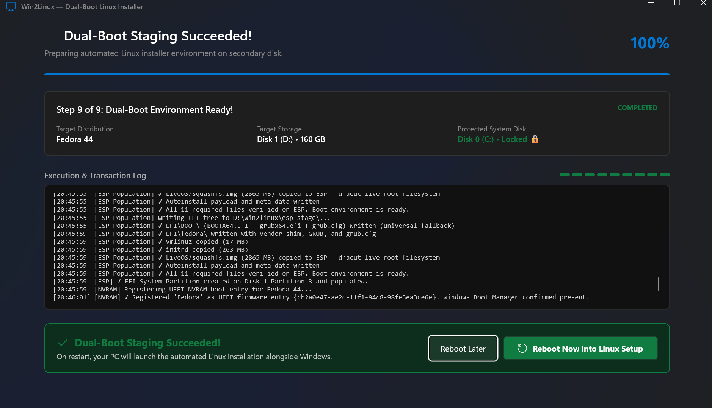
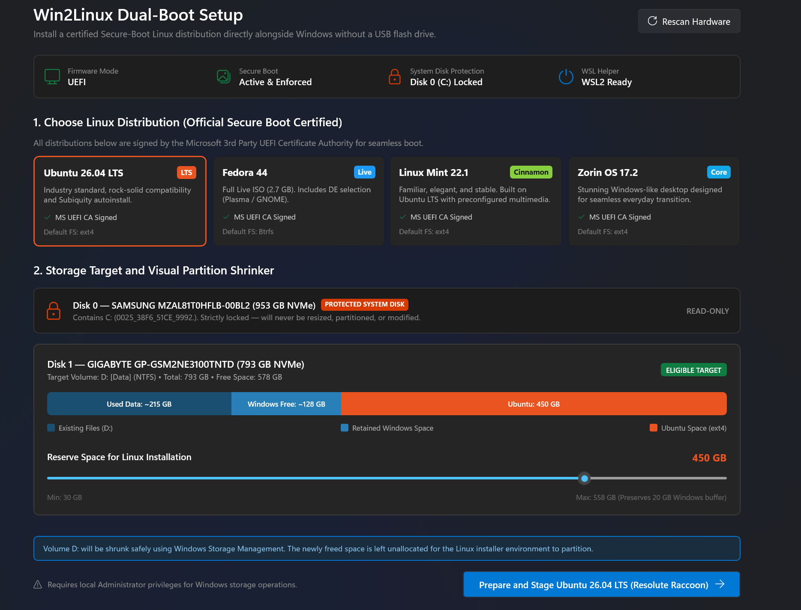

# Win-2-Linux

### Install Linux alongside Windows; directly from Windows!

Win-2-Linux is a Windows-native Linux installation tool designed to make setting up a real Linux dual-boot environment as simple as possible.

Instead of manually creating a bootable USB, repartitioning disks, configuring GRUB, and installing Linux through a traditional installer, Win-2-Linux orchestrates the process directly from Windows.

## But, what is Win-2-Linux?

Win-2-Linux aims to provide a Wubi-like ([Find more here](https://github.com/hakuna-m/wubiuefi)) installation experience for modern UEFI systems, while still producing a conventional Linux installation.

The resulting Linux system is not:
- WSL
- a virtual machine
- a Linux filesystem stored inside an NTFS file
- a Linux environment dependent on Windows

Instead, Win-2-Linux creates a real physical Linux installation on your disk with its own filesystem, kernel, bootloader, and UEFI boot entry.

The goal is simple: <br>
`
Take unused space from a secondary Windows SSD that doesn't house the OS (aka the C:/ drive) and turn a portion of it into a proper Linux installation
`

## Features

The main constraint to getting started with Linux personally, for me, and a lot of other beginners, is the setup process. And therefore, I wanted to make it simpler. 

- Windows-native installation; install Linux from Windows without a USB
- Real physical Linux installation on your disk (not WSL, not a VM)
- GRUB first boot support 
- Ubuntu 26, Fedora 44 (KDE Plasma default or GNOME Workstation), Linux Mint 22.1, or Zorin OS 17.2
- Built with modern .NET 8, C#, and WinUI 3 (Windows App SDK Fluent Design)
- Protects the Windows system disk from destructive partition operations
- Boots into an independent Linux installation after setup


## Downloads & Releases

### Download Pre-built Binaries (Recommended)
You can download the latest pre-compiled release from [GitHub Releases](https://github.com/LunaticPython2003/Win-2-Linux/releases):

- **[Win2Linux-v1.0.0-win-x64.zip](https://github.com/LunaticPython2003/Win-2-Linux/releases/latest)**: Complete WinUI 3 desktop application with Fluent Design.
  1. Download and extract the `.zip` archive.
  2. Right-click `Start-Win2Linux.cmd` (or `Win2Linux.UI.exe`) and select **Run as administrator**.
  3. Select your preferred Linux distribution and target partition, then begin setup!
- **[win2linux-cli-v1.0.0-x64.exe](https://github.com/LunaticPython2003/Win-2-Linux/releases/latest)**: Standalone single-file CLI for command-line users.

---

## Getting Started & Building from Source

### System Requirements

The intended v1 environment is:
- A modern Windows 10 (version 1809+) or Windows 11 installation
- UEFI firmware (Secure Boot supported)
- Administrator privileges
- An NTFS volume containing enough free space
- WSL setup (optional fallback)

### Build from Source

If you want to build and run Win-2-Linux directly from source code:

#### Prerequisites
- [.NET 8.0 SDK](https://dotnet.microsoft.com/download/dotnet/8.0) or newer
- Git for Windows

#### 1. Clone the Repository
```bash
git clone https://github.com/LunaticPython2003/Win-2-Linux.git
cd Win-2-Linux
```

#### 2. Run Directly in Development
Launch the WinUI 3 desktop app directly with elevated permissions:
```cmd
Start-Win2Linux.cmd
```
*Alternatively, run from an elevated PowerShell terminal:*
```powershell
dotnet run --project src\Win2Linux.UI
```

#### 3. Compile Standalone Release Executables
To produce self-contained, standalone executables:

```powershell
# Compile the WinUI 3 Fluent UI desktop app (Unpackaged, Self-Contained)
dotnet publish src\Win2Linux.UI\Win2Linux.UI.csproj -c Release -r win-x64 --self-contained true -o dist\Win2Linux-win-x64

# Compile the standalone single-file CLI executable
dotnet publish src\Win2Linux.Cli\Win2Linux.Cli.csproj -c Release -r win-x64 --self-contained true -p:PublishSingleFile=true -o dist\cli
```

#### 4. Run Automated Tests
Run the comprehensive test suite verifying Microsoft UEFI CA signatures, kickstart/preseed generation, and safety invariants:
```powershell
dotnet test tests\Win2Linux.Tests\Win2Linux.Tests.csproj
```

### Important Warnings

This software can modify disk partitions.

Although Win-2-Linux is designed to protect the Windows system disk, partition manipulation always carries a risk of data loss.

Before using it:

- Back up your data.
- Do not rely on this project as your only protection against:
- power failure
- disk failure
- firmware bugs
- filesystem corruption
- unexpected Windows updates
- user error
- hardware failure

If the installer detects an unsafe configuration, do not bypass the safety checks.

## Sounds too good to be true, whats the catch?

The installer is currently limited to Microsoft signed Linux distros because of the secure boot limitation. Although, WSL setup is optional for fallback, it is still recommended to be setup for the installer to work smoothly. Even though the installer prohibits itself from touching the Windows partition, manipulating storage partition always comes with the baggage of potential failure.

## Future Plans

- [ ] Add support for more Linux distros
- [ ] Add support for more bootloaders
- [ ] Add support for more UEFI boot entries
- [ ] Add support for automatically signing unsupported distros for Secure Boot
- [ ] Make it possible to completely bypass the need for booting into installer (that is, if its even possible to do it in a safe manner)
- [ ] Bring your own ISO support

## Screenshots
 <br>
<b> Installation screen <br> <br>

 <br>
<b> Distro selection <br>
